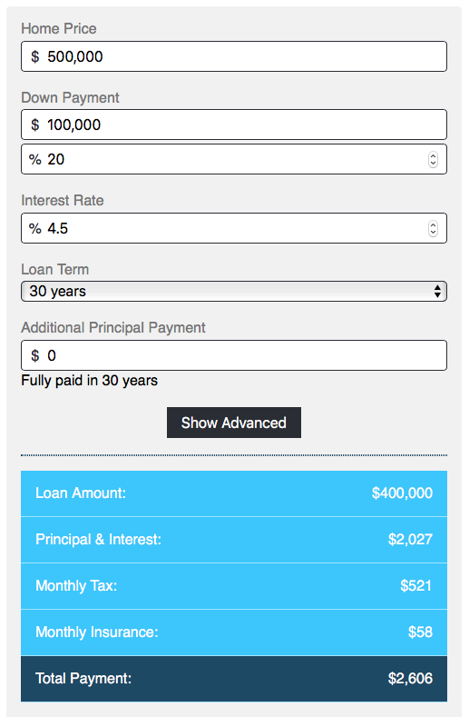

# Mortgage Calculator React
A simple mortgage calculator as a React component. Using [mortgage-js](https://github.com/tommymcglynn/mortgage-js) for payment calculations.

## Sample App
You can try out the mortgage calculator. Run the following commands to start the sample app.

    // Install dependencies
    npm install
    // Start sample app
    npm start

Then open http://localhost:8080 in your browser. If port 8080 is already in-use, the dev server may start on a different port. Look for the following log output: "Project is running at" to determine the correct port.

## Usage in Your App
Install the calculator as an npm module.

    npm install mortgage-calculator-react

Then include the mortgage calculator in your app and use it as a React component.

    import MortgageCalculator from "mortgage-calculator-react";
    
    const reactElement = (
        

            <MortgageCalculator/>
        

    );

## CSS Styling
The calculator uses a default style "DefaultStyle.css". You could create a copy of this file and modify it to achieve any aesthetic for the mortgage calculator.

    import customStyle from "./CustomStyle.css";
    <MortgageCalculator styles={customStyle} />

## Embed in Web Page
You can embed the mortgage calculator into any web page. Simply insert the following HTML.

    

    
    
## Additional props
You can ovverride default props.

    
    <MortgageCalculator price={125000} downPayment={10000} interestRate={0.065} months={5} taxRate={2} insuranceRate={1} mortgageInsuranceEnabled={false} additionalPrincipal={12500} />
